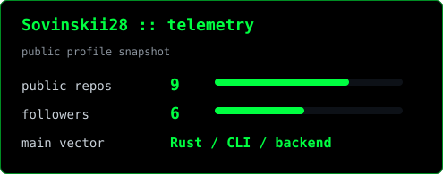
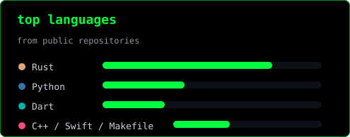

<p align="center">
  
</p>

<div align="center">
  
</div>

<p align="center">
  <a href="https://github.com/Sovinskii28?tab=repositories">
    
  </a>
  <a href="https://github.com/Sovinskii28">
    
  </a>
  
</p>

<div align="center">
  
</div>

```txt
sova@github:~$ whoami
backend / systems developer

sova@github:~$ cat focus.txt
Rust services, CLI tools, image processing, network utilities,
small production-minded projects, readable code, useful docs.

sova@github:~$ ./current_targets
[01] imgix   -> high-performance Rust media microservice
[02] mxFind  -> Matrix public room discovery CLI/TUI
[03] chameleon  -> mobile photo editor with filters
```

## ./stack

<p>
  
  
  
  
  
  
  
  
</p>

## ./featured

| target | status | stack |
| --- | --- | --- |
| [SecondTick] (https://github.com/Sovinskii28/SecondTick) | Локальное desktop-приложение для учёта рабочего времени и заработка | `TypeScript`, `Rust`
| [imgix](https://github.com/Sovinskii28/imgix) | Rust microservice for compression, resizing, and media processing | `Rust` |
| [mxFind](https://github.com/Sovinskii28/mxFind) | CLI/TUI for discovering public Matrix rooms | `Rust` |
| [chameleon](https://github.com/Sovinskii28/chameleon) | mobile/app project | `Dart` |

## ./telemetry

<p>
  
  
</p>

<p>
  
</p>

## ./now

- sharpening Rust backend architecture
- building practical tools that are easy to run and inspect
- learning deeper systems programming and service design

## ./contact

- GitHub: [@Sovinskii28](https://github.com/Sovinskii28)
- Telegram: `@SOVINSKII`

<div align="center">
  
</div>
